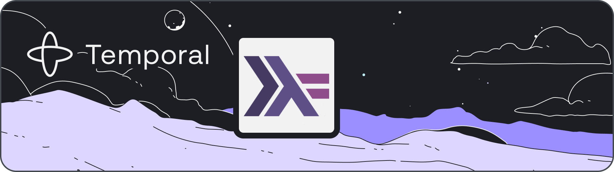

  

  <!--  -->
  

[Temporal](https://temporal.io) is a durable execution system that transparently makes your code durable, fault-tolerant, and simple.

"Temporal Haskell SDK" is the framework for authoring workflows and activities using the Haskell programming language with the GHC compiler.

This SDK requires Temporal Server >= 1.20

For documentation and samples, see:

- [General Temporal docs](https://docs.temporal.io)

## Packages

This monorepo contains the following packages:

| Subfolder | Package |
|-----------|---------|
| [`core/`](core/)                                  | `temporal-sdk-core`                                            |
| [`codec-encryption/`](codec-encryption/)          | `temporal-codec-encryption`                                    |
| [`codec-server`](codec-server/)                   | `temporal-sdk-codec-server`                                    |
| [`optimal-codec/`](optimal-codec/)                | `temporal-sdk-optimal-codec`                                   |
| [`protos/`](protos/)                              | `temporal-api-protos`                                          |
| [`./`](./)                                        | `temporal-sdk`                                                 |

## Notes

- The Cabal package is configured to automatically build the Rust dependency while developing the library. You must have `cargo` installed in order for this to work.

## Handy Development Commands

- `nix build .` builds the Haskell program.
- `nix build .#hs_temporal_bridge` builds the Rust library.
- `nix develop` enters the development Shell for the Haskell program.
  - `stack` supports a GHC 9.2.x build environment
  - `cabal` supports a GHC 9.6.x build environment

## Pending work for v0.0.1.0

- [ ] Tested replay support
- [ ] Tutorial Module(s)
