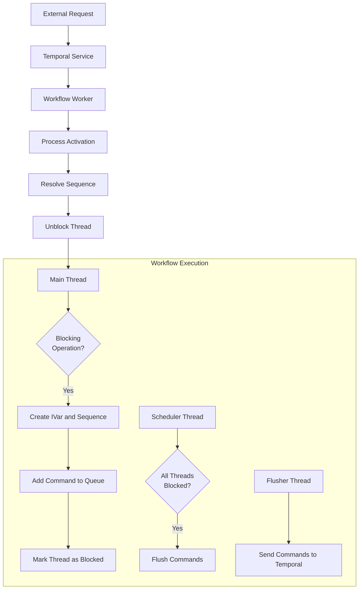
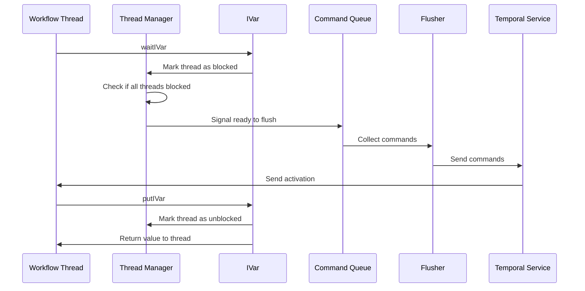

# Temporal SDK Internal Docs

Documentation for the Haskell Temporal SDK's STM-based workflow implementation. This is for developers working on the SDK or those curious about how it works internally.

Each doc links to related docs for easy navigation.

## Core Components

### [Workflow STM Implementation](workflow-stm.md)

This document provides a comprehensive overview of how the Haskell SDK uses Software Transactional Memory (STM) to implement workflow execution. It covers:

- The core concurrency model using STM
- Thread management and blocking mechanisms
- How workflow execution is structured
- The activation processing flow
- Diagrams illustrating the workflow lifecycle

### [Command Queue](command-queue.md)

This document explains the Command Queue system, which is responsible for collecting and flushing commands from workflows to the Temporal service:

- Command Queue structure and implementation
- How commands flow through the system
- Command batching and flow control
- Integration with the workflow lifecycle

### [Sequence Management System](sequence-management.md)

This document details how the Sequence Management System works to correlate asynchronous operations:

- How sequence numbers are generated and tracked
- How operations like activities, timers, and child workflows are correlated with their completions
- Sequence handling for different operation types
- Error handling in the sequence system

## Workflow Execution Flow

## Blocking and Unblocking

The core of our SDK is the ability to block and unblock threads deterministically based on external events. This works through:

1. `IVar`s that threads wait on
2. The `ThreadManager` tracking thread states
3. The `waitAllBlocked` mechanism triggering command flushes
4. Activation handling that resolves `IVar`s and unblocks threads

### Key Interactions

## Key Implementation Challenges & Solutions

Our STM approach solves several challenges:

1. **Determinism** - STM makes state changes atomic and composable for replay
2. **Concurrency** - Multiple operations run concurrently while maintaining determinism
3. **Blocking** - Threads block without consuming resources or affecting determinism
4. **Error Handling** - Errors propagate naturally like normal results

## See Also

For additional information:

- [Temporal Documentation](https://docs.temporal.io/)
- [Haskell SDK API Documentation](../README.md)
- [STM Documentation](https://hackage.haskell.org/package/stm)
