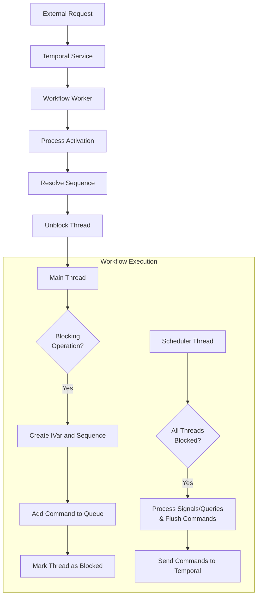
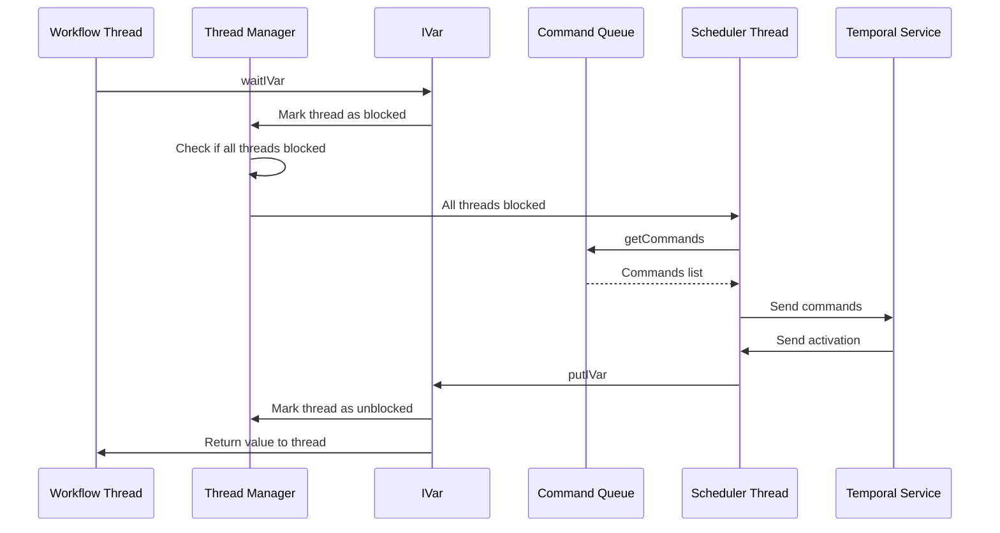
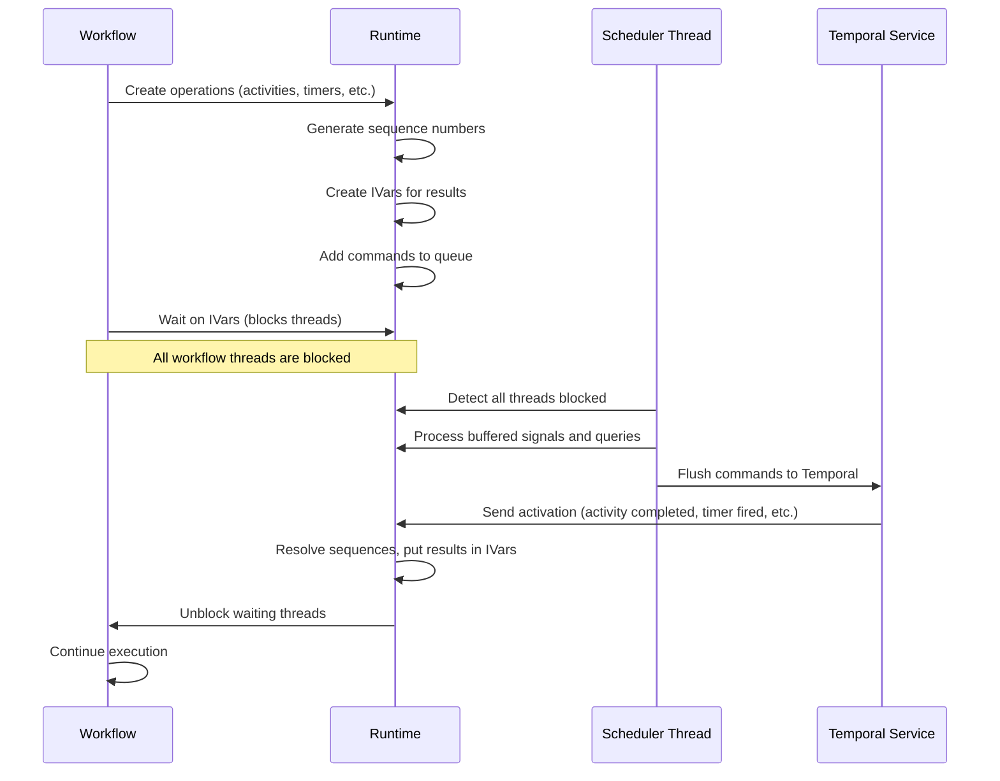
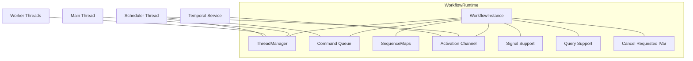

# Temporal SDK Internal Docs

Documentation for the Haskell Temporal SDK's STM-based workflow implementation. This is for developers working on the SDK or those curious about how it works internally.

Each doc links to related docs for easy navigation.

## Core Components

### [Workflow STM Implementation](workflow-stm.md)

This document provides a comprehensive overview of how the Haskell SDK uses Software Transactional Memory (STM) to implement workflow execution. It covers:

- The core concurrency model using STM
- Thread management and blocking mechanisms
- How workflow execution is structured
- The activation processing flow
- Diagrams illustrating the workflow lifecycle

### [Command Queue](command-queue.md)

This document explains the Command Queue system, which is responsible for collecting and flushing commands from workflows to the Temporal service:

- Command Queue structure and implementation
- How commands flow through the system
- Command batching and flow control
- Integration with the workflow lifecycle

### [Sequence Management System](sequence-management.md)

This document details how the Sequence Management System works to correlate asynchronous operations:

- How sequence numbers are generated and tracked
- How operations like activities, timers, and child workflows are correlated with their completions
- Sequence handling for different operation types
- Error handling in the sequence system

## Deterministic Threading Model

Workflows in Temporal must be deterministic, which poses a fundamental challenge for concurrency. The Haskell SDK solves this through a specialized thread blocking detection system:

### Thread Blocking Detection

The key innovation in our implementation is detecting when workflow threads are stuck waiting for external input:

- We track when each thread is blocked waiting for results (activities, timers, etc.)
- When all threads are blocked, we know the workflow can't proceed until external input arrives
- This is the trigger to flush accumulated commands to Temporal
- When responses come back, we selectively unblock only the specific threads waiting for those results

This approach differs from typical Haskell concurrency where:
1. Thread scheduling is non-deterministic
2. There's no way to know when all threads are stuck waiting for external results
3. There's no central mechanism controlling when threads are unblocked

### Thread Blocking and Unblocking

The core mechanism that enables deterministic concurrency is our precise thread blocking system:

1. Workflow threads only block when explicitly waiting for results (activities, timers, etc.)
2. When a thread blocks, it marks itself as blocked in the ThreadManager
3. When all threads are blocked, the workflow flushes commands to Temporal
## Workflow Execution Flow



## Blocking and Unblocking

The core of our SDK is the ability to detect when threads are blocked waiting for external events, and to selectively unblock them when results arrive. This works through:

1. `IVar`s that threads wait on
2. The `ThreadManager` tracking thread blocking states
3. The `waitAllThreadsBlocked` mechanism triggering command flushes
4. Activation handling that resolves `IVar`s and precisely unblocks threads

### Key Interactions



## Workflow Execution Cycle



## Concurrency Types and Primitives

The SDK provides several key types for maintaining state and enabling concurrency:

### StateVar

`StateVar` provides a safe way to maintain mutable state in a workflow:

```haskell
data StateVar a = StateVar
  { stateVarRef :: {-# UNPACK #-} !(TVar a)
  , stateVarBlocks :: {-# UNPACK #-} !(TVar (HashSet ThreadId))
  }

-- Create a new StateVar
newStateVar :: a -> Workflow (StateVar a)

-- Read from a StateVar (available in Workflow, Query, and Condition monads)
readStateVar :: MonadReadStateVar m => StateVar a -> m a

-- Write to a StateVar (only available in Workflow monad)
writeStateVar :: StateVar a -> a -> Workflow ()
```

### Condition

`Condition` allows a workflow to wait for a condition to become true:

```haskell
newtype Condition a = Condition (STM a)

-- Block until condition becomes true
waitCondition :: Condition Bool -> Workflow ()
```

### ConcurrentWorkflow

`ConcurrentWorkflow` provides deterministic concurrency:

```haskell
newtype ConcurrentWorkflow a = ConcurrentWorkflow {runConcurrentWorkflowActions :: Workflow a}

-- Primitive for running concurrent workflow actions
runConcurrentWorkflowActions :: ConcurrentWorkflow a -> Workflow a
```

## Key Implementation Challenges & Solutions

Our STM approach solves several challenges:

1. **Determinism** - STM makes state changes atomic and composable for replay
2. **Concurrency** - Precise unblocking enables deterministic concurrency
3. **Blocking Detection** - Detecting when threads can't proceed without external input
4. **Error Handling** - Errors propagate naturally like normal results
5. **Signal and Query Processing** - Buffering and processing when the workflow is in a consistent state
6. **Selective Thread Resumption** - Unblocking only the specific threads that can make progress

## Core Runtime Components



## See Also

For additional information:

- [Temporal Documentation](https://docs.temporal.io/)
- [Haskell SDK API Documentation](../README.md)
- [STM Documentation](https://hackage.haskell.org/package/stm)
