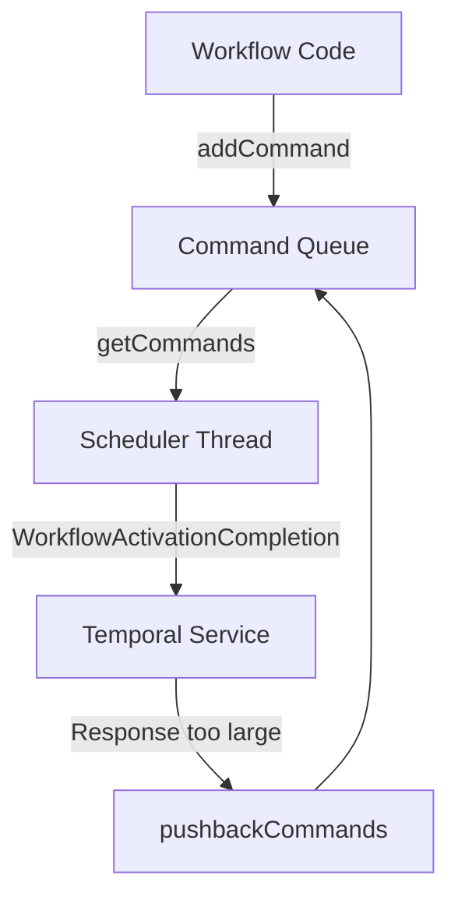
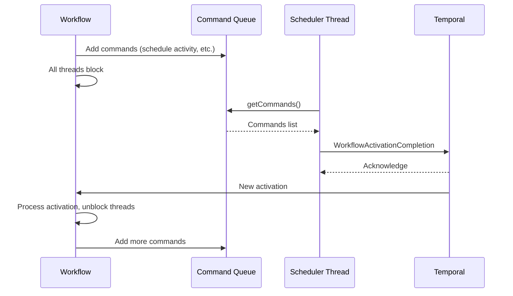
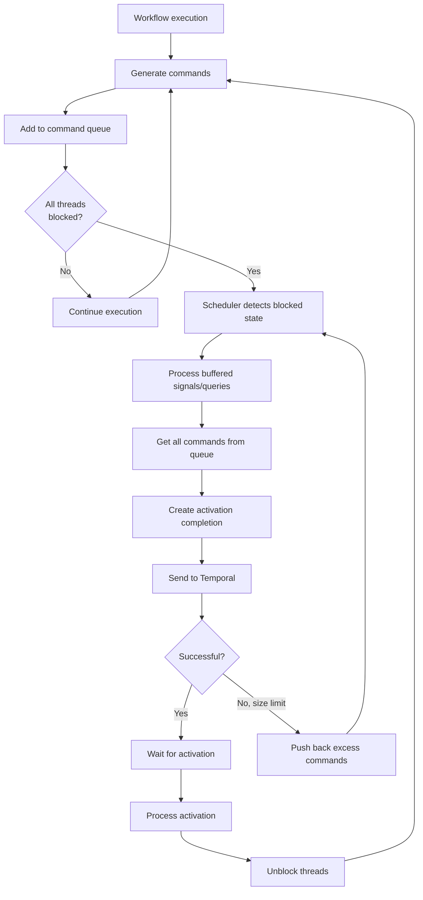
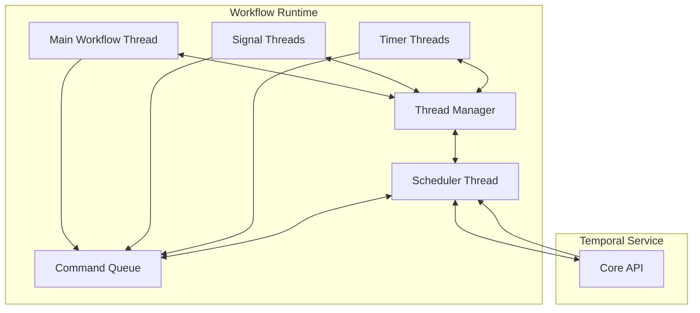

# Command Queue

How workflow commands flow from execution to the Temporal service.

*See also: [Workflow STM Implementation](workflow-stm.md) | [Sequence Management](sequence-management.md)*

## Overview

Workflows generate commands that need to be sent to Temporal for execution - scheduling activities, starting timers, completing workflows, etc. Our `CommandQueue` handles:

1. Collecting commands during workflow execution
2. Flushing them to Temporal at the right time
3. Managing command batching and flow control

These commands come from workflow operations described in the [Workflow STM doc](workflow-stm.md).

## Structure

The `CommandQueue` uses STM primitives:

```haskell
data CommandQueue = CommandQueue
  { commandQueue :: {-# UNPACK #-} !(TQueue WorkflowCommand)
  , commandQueuePushback :: {-# UNPACK #-} !(TVar [WorkflowCommand])
  -- ^ Sometimes we have a lot of commands to send, and they exceed
  -- the gRPC body size limit. We can use this to push back commands
  -- that haven't been sent yet.
  }
```

It has:

1. `commandQueue`: A `TQueue` that holds commands as they're generated
2. `commandQueuePushback`: A `TVar` for storing commands that couldn't be sent in the previous flush due to size limits

## Command Flow



### Adding Commands

When a workflow operation needs to send a command to Temporal (like starting an activity), it adds it to the queue:

```haskell
addCommand :: WorkflowCommand -> InstanceM ()
addCommand command = do
  inst <- ask
  atomically $ CommandQueue.addCommand inst command
```

This happens in an STM transaction for atomicity.

### Flushing Commands

When the workflow is in a blocked state (all threads waiting for external input), the scheduler thread collects and sends all commands:

```haskell
getCommands :: HasCommandQueue a => a -> STM [WorkflowCommand]
getCommands runtime = do
  let q = getCommandQueue runtime
  commands <- readTVar q.commandQueuePushback
  writeTVar q.commandQueuePushback []
  remainder <- flushTQueue q.commandQueue
  pure (commands <> remainder)
```

This process:
1. Gets any "pushback" commands from previous flushes
2. Clears the pushback storage
3. Gets all commands currently in the queue
4. Combines them for sending

### Handling Large Batches

If a command batch is too large for a single gRPC message, we "push back" the excess commands for the next flush:

```haskell
pushbackCommands :: HasCommandQueue a => a -> [WorkflowCommand] -> STM ()
pushbackCommands q remainder = do
  writeTVar (getCommandQueue q).commandQueuePushback remainder
```

## Integration with Workflow Lifecycle

The command queue is tightly connected to the workflow lifecycle:

1. **Command Generation**: Normal workflow execution adds commands to the queue
2. **Blocked State Detection**: When all threads block, the scheduler triggers a flush
3. **Command Flushing**: The scheduler thread sends commands to Temporal
4. **Activation Processing**: New activations unblock threads, which may generate more commands

The [Sequence Management](sequence-management.md) system matches responses back to the original requests, letting workflows know when operations complete.



## Complete Flush Cycle



## Command Queue in Context

The command queue operates within the broader context of the workflow runtime:



## Implementation of Command Flushing

The scheduler thread is responsible for flushing commands when all threads are blocked:

```haskell
flushCommands :: (HasCallStack, MonadIO m) => WorkflowRuntime -> m ()
flushCommands runtime = do
  (info, cmds) <- atomically do
    info <- readTVar runtime.workflowRuntimeInstance.workflowInstanceInfo
    cmds <- CommandQueue.getCommands runtime.workflowRuntimeCommandQueue
    pure (info, cmds)
  let completionSuccessful :: Core.Success
      completionSuccessful = defMessage & Completion.commands .~ cmds
      completionMessage :: Core.WorkflowActivationCompletion
      completionMessage =
        defMessage
          & Completion.runId .~ rawRunId info.runId
          & Completion.successful .~ completionSuccessful
  res <- liftIO $ runtime.workflowRuntimeInstance.workflowCompleteActivation completionMessage
  case res of
    Left err -> throwIO err
    Right () -> pure ()
```

The scheduler handles this as part of its main loop, which runs as follows:

1. Apply any pending activations
2. Wait for all jobs to be handled
3. Wait for all threads to block
4. Process any buffered signals
5. Process any buffered queries
6. Flush commands to Temporal
7. Wait for the next activation

## Best Practices

When working with the command queue:

1. **Atomicity**: Always manipulate the queue within STM transactions
2. **Batching**: Be aware of large command batch issues
3. **Flow Control**: Use the pushback mechanism when needed
4. **Determinism**: Remember the order of commands matters for replay
