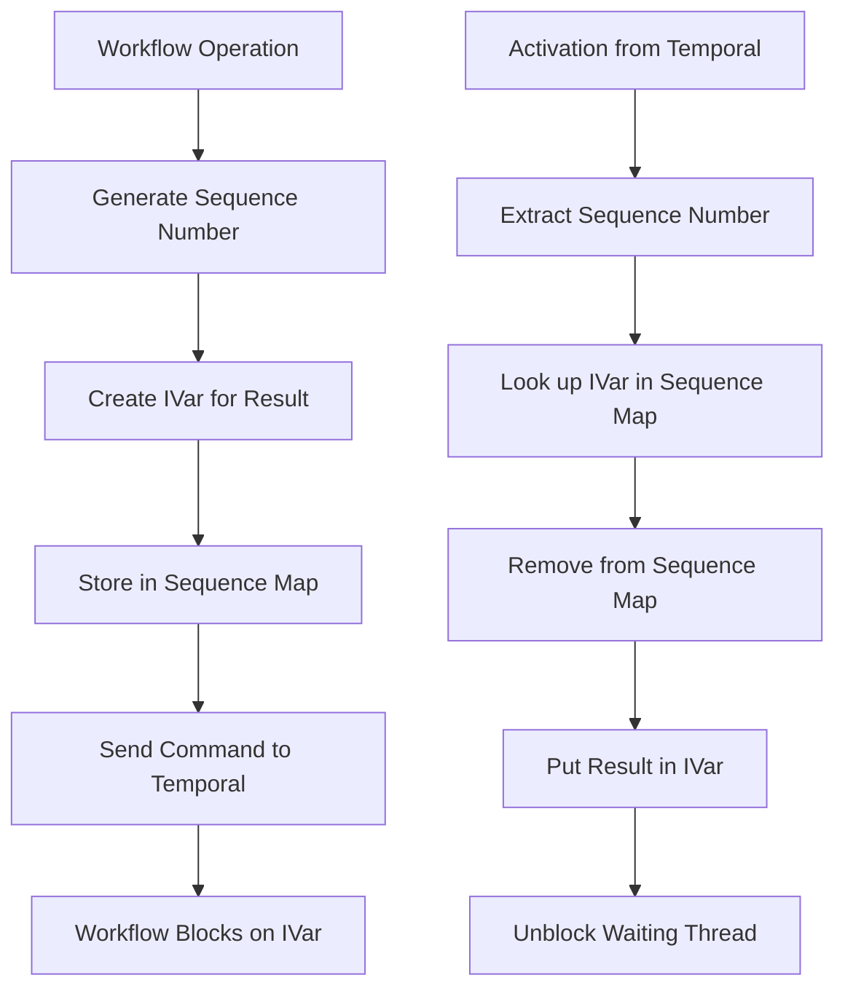
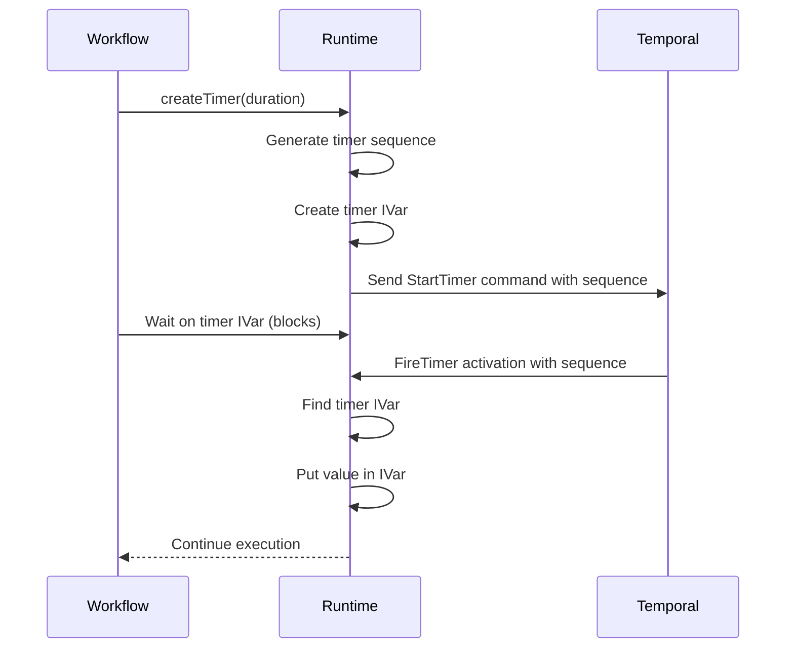
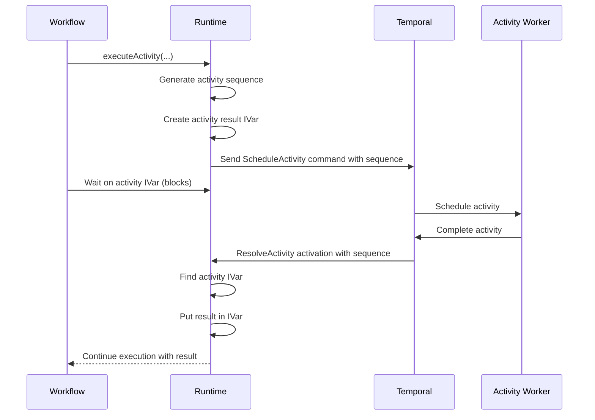
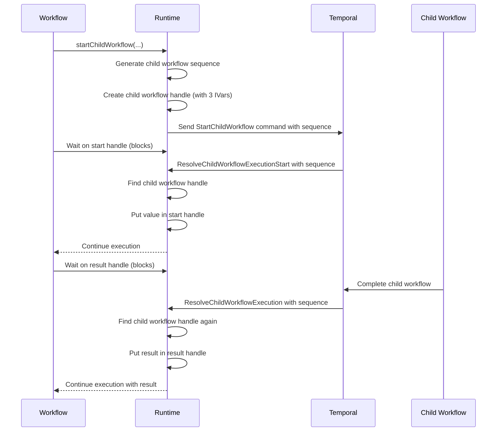
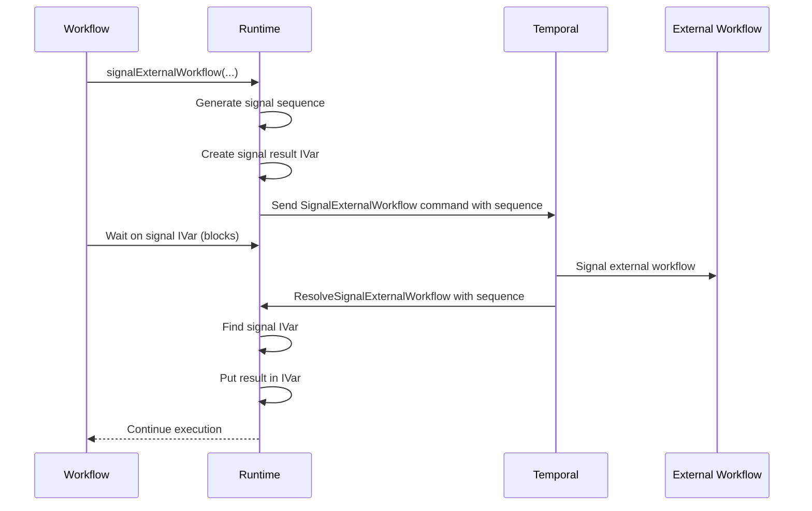
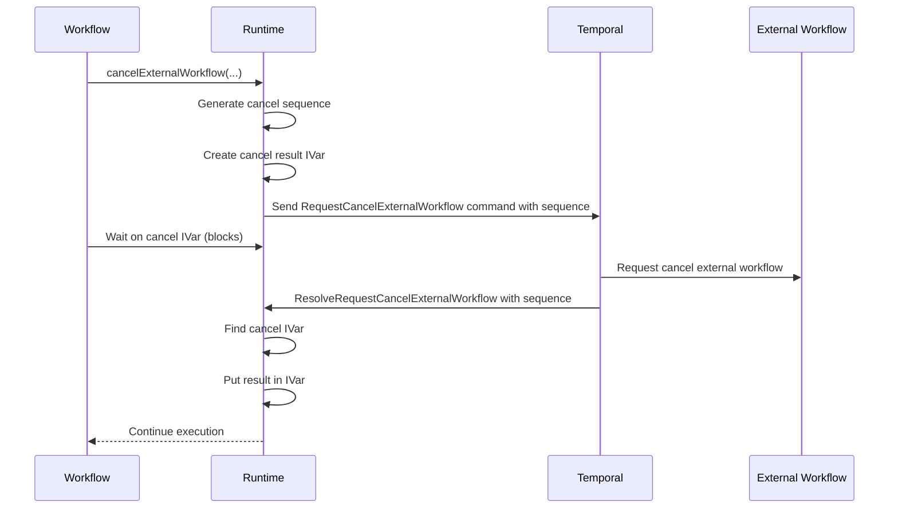

# Sequence Management

How we match commands with their responses in Temporal workflows.

*See also: [Workflow STM Implementation](workflow-stm.md) | [Command Queue](command-queue.md)*

## Overview

In Temporal workflows, operations are asynchronous and we need to match requests with their eventual responses. When a workflow schedules an activity, we need to match the completion with the original request.

Sequences connect the [Command Queue](command-queue.md) (which sends commands) with the activation processing system (from the [Workflow STM doc](workflow-stm.md#activation-processing)), letting workflow threads block and unblock at the right times.

## Structure

Our sequence system consists of:

```haskell
-- Simple identifier for tracking sequences
newtype Sequence = Sequence Word32

-- Maps for different types of sequences
data SequenceMaps = SequenceMaps
  { timers :: {-# UNPACK #-} !(TVar (SequenceMap (IVar ())))
  , activities :: {-# UNPACK #-} !(TVar (SequenceMap (IVar ResolveActivity)))
  , childWorkflows :: {-# UNPACK #-} !(TVar (SequenceMap (ChildWorkflowHandle Any)))
  , externalSignals :: {-# UNPACK #-} !(TVar (SequenceMap (IVar ResolveSignalExternalWorkflow)))
  , externalCancels :: {-# UNPACK #-} !(TVar (SequenceMap (IVar ResolveRequestCancelExternalWorkflow)))
  , counters :: {-# UNPACK #-} !Sequences
  }

-- Counters for generating sequence numbers
data Sequences = Sequences
  { externalCancel :: {-# UNPACK #-} !(TVar Word32)
  , childWorkflow :: {-# UNPACK #-} !(TVar Word32)
  , externalSignal :: {-# UNPACK #-} !(TVar Word32)
  , timer :: {-# UNPACK #-} !(TVar Word32)
  , activity :: {-# UNPACK #-} !(TVar Word32)
  }
```

We maintain:

1. **Type-specific counters** - One for each operation type
2. **Sequence maps** - Associate sequence numbers with their IVars or handles
3. **Resolution function** - Finds and removes entries when activations arrive

## How It Works



The command sending part (steps A-E) works with the [Command Queue](command-queue.md), while activation handling and thread unblocking (steps G-L) work with the [blocking mechanism](workflow-stm.md#blocking-mechanism).

### Generating Sequences

When a workflow needs to send a command to Temporal (like starting an activity), we first generate a sequence number:

```haskell
-- Example for activity sequences
nextActivitySequence :: InstanceM Sequence
nextActivitySequence = atomically do
  runtime <- ask
  Sequence <$> stateTVar
    runtime.workflowRuntimeSequenceMaps.counters.activity
    (\s -> (s, s + 1))
```

Sequences start at 1 (since 0 looks uninitialized in protobuf) and increment for each operation.

### Registering Sequences

The operation creates an IVar to hold the eventual result and registers it:

```haskell
-- Example for activities
startActivityFromPayloads :: KnownActivity args result -> StartActivityOptions -> Vector Payload -> Workflow (Task result)
startActivityFromPayloads (KnownActivity codec name) opts typedPayloads = Workflow $ withRunInIO $ \runInIO -> runInIO $ do
  runtime <- ask
  s@(Sequence actSeq) <- nextActivitySequence
  resultSlot <- newIVar $ getThreadManager runtime
  atomically $
    modifyTVar'
      runtime.workflowRuntimeSequenceMaps.activities
      (HashMap.insert s resultSlot)

  -- Create and add command with sequence number
  -- Return Task that waits on the resultSlot
```

### Selective Thread Unblocking

The sequence system is tightly integrated with the thread blocking detection system:

1. When a workflow operation (like activity execution) is started, a thread blocks waiting for the result by waiting on an IVar
2. The scheduler thread detects that all threads are blocked and flushes commands
3. When an activation arrives, it uses the sequence number to find the exact IVar that needs to be resolved
4. Only the specific thread waiting on that IVar is unblocked, while other threads remain blocked
5. This selective unblocking is what enables deterministic concurrency even with multiple parallel operations

This precision in tracking which threads are waiting for which results is the key to maintaining determinism.

### Resolving Sequences

When an activation returns from Temporal with a sequence number, the handler looks up and resolves the corresponding IVar:

```haskell
handleResolveActivity :: WorkflowRuntime -> ResolveActivity -> STM (IO ())
handleResolveActivity runtime msg = do
  markJobHandled runtime
  let a = msg ^. Activation.seq . to Sequence
  mvar <- resolveSequence runtime.workflowRuntimeSequenceMaps.activities a
  case mvar of
    Nothing -> Catch.throwM $ RuntimeError "Activity handle not found"
    Just existing -> do
      putIVar existing msg
      pure $ pure ()
```

The `resolveSequence` function efficiently looks up and removes the entry in one atomic operation:

```haskell
resolveSequence :: TVar (SequenceMap a) -> Sequence -> STM (Maybe a)
resolveSequence sequenceMap seq =
  stateTVar sequenceMap $ \m -> (HashMap.lookup seq m, HashMap.delete seq m)
```

## Sequence Types

We manage several types of sequences:

### 1. Timer Sequences

Used for workflow timers and sleep operations.



### 2. Activity Sequences

Used for tracking activities executed by the workflow.



### 3. Child Workflow Sequences

Used for tracking child workflows. These are more complex because they involve multiple phases:



Child workflow handles have more complexity since they manage the full lifecycle:

```haskell
ChildWorkflowHandle
  { childWorkflowSequence = s
  , startHandle = startSlot                -- IVar for start completion
  , resultHandle = resultSlot              -- IVar for workflow result
  , firstExecutionRunId = firstExecutionRunId  -- IVar for RunId
  , childWorkflowResultConverter = pure    -- Function to convert result
  , childWorkflowId = wfId                 -- Workflow ID
  }
```

### 4. External Signal Sequences

Used for tracking signals sent to external workflows.



### 5. External Cancel Sequences

Used for tracking cancellation requests sent to external workflows.



## Concurrency and Determinism

The sequence system provides the backbone for safe concurrency in workflows:

1. **Targeted Unblocking**: Only the exact threads waiting for a specific result are unblocked
2. **Independent Blocking**: Multiple threads can block on different sequences without interference
3. **Deterministic Ordering**: Sequence generation and resolution happen in a consistent order
4. **Controlled Parallelism**: Allows effective parallel execution while maintaining determinism

This is what powers higher-level concurrency primitives like `race`, `concurrently`, and `mapConcurrently` - they ultimately rely on the sequence system to precisely control which threads are unblocked in response to which events.

## Integration with Thread Blocking Detection

The sequence system works directly with the [thread blocking detection](workflow-stm.md#thread-blocking-detection):

1. When a thread waits on an IVar in a sequence map, it marks itself as blocked in the ThreadManager
2. When all threads are blocked, the scheduler detects this and flushes commands to Temporal
3. When an activation comes back with a sequence number, it resolves the IVar associated with that sequence
4. This selectively unblocks only the thread waiting on that specific IVar
5. The cycle repeats as threads continue executing until they block again

## Activation Job Handlers

Each activation job type has a specialized handler that resolves the appropriate sequence:

```haskell
handleFireTimer runtime msg = do
  markJobHandled runtime
  let t = msg ^. Activation.seq . to Sequence
  mvar <- resolveSequence runtime.workflowRuntimeSequenceMaps.timers t
  case mvar of
    Nothing -> Catch.throwM $ RuntimeError "Timer not found"
    Just ivar' -> do
      putIVar ivar' ()
      pure $ pure ()
```

The handler:
1. Marks the job as handled (decrements the job counter)
2. Extracts the sequence number from the activation
3. Resolves the sequence to find the corresponding IVar
4. Puts the result in the IVar, unblocking any waiting threads
5. Returns any IO operations that need to be performed

## Error Handling

We handle several error scenarios:

1. **Missing Sequences**: If an activation references a sequence that doesn't exist
2. **Failed Operations**: Errors get put into the IVar, causing waiting threads to throw exceptions
3. **Sequence Cleanup**: Sequences are removed after resolution to prevent memory leaks

## Implementation Notes

1. **Atomicity**: All sequence operations happen within STM transactions
2. **Determinism**: Sequence generation must be deterministic during replay
3. **Memory Management**: We remove sequences after resolution
4. **Error Propagation**: Errors flow through the same IVar mechanism
