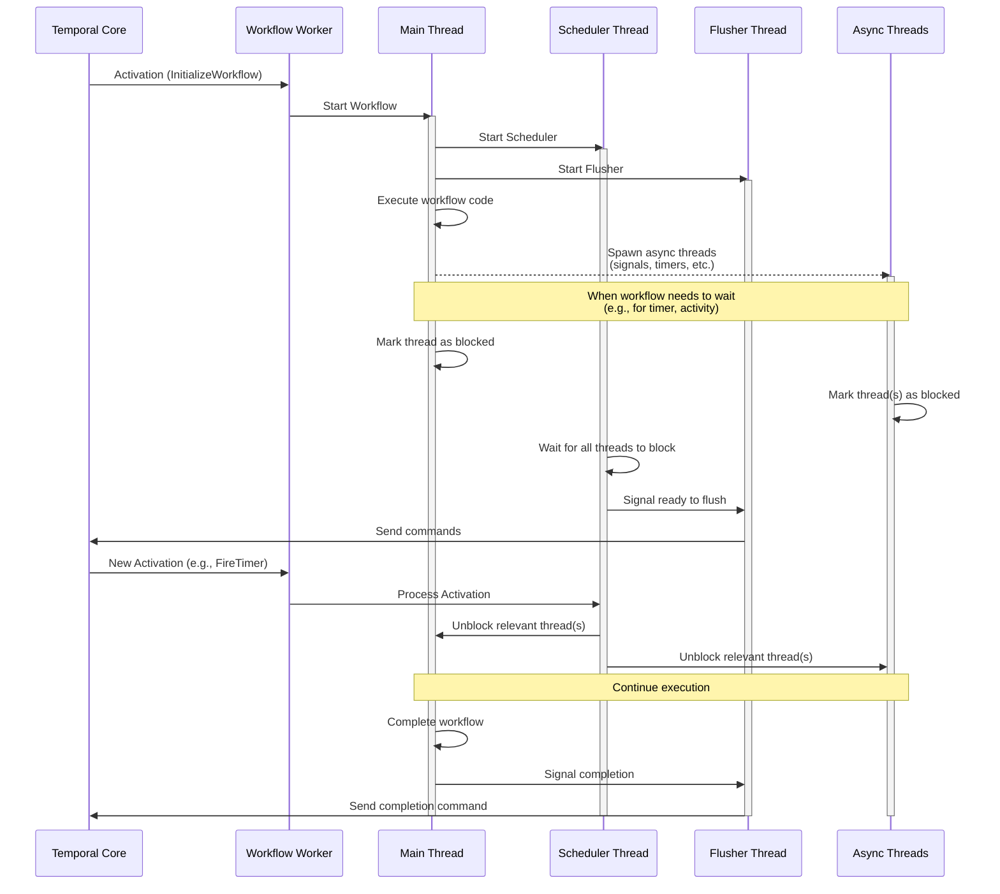
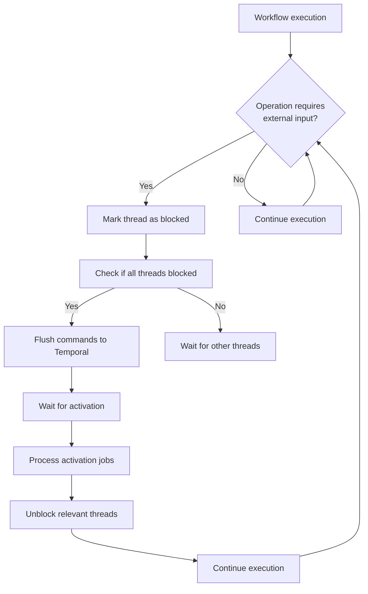
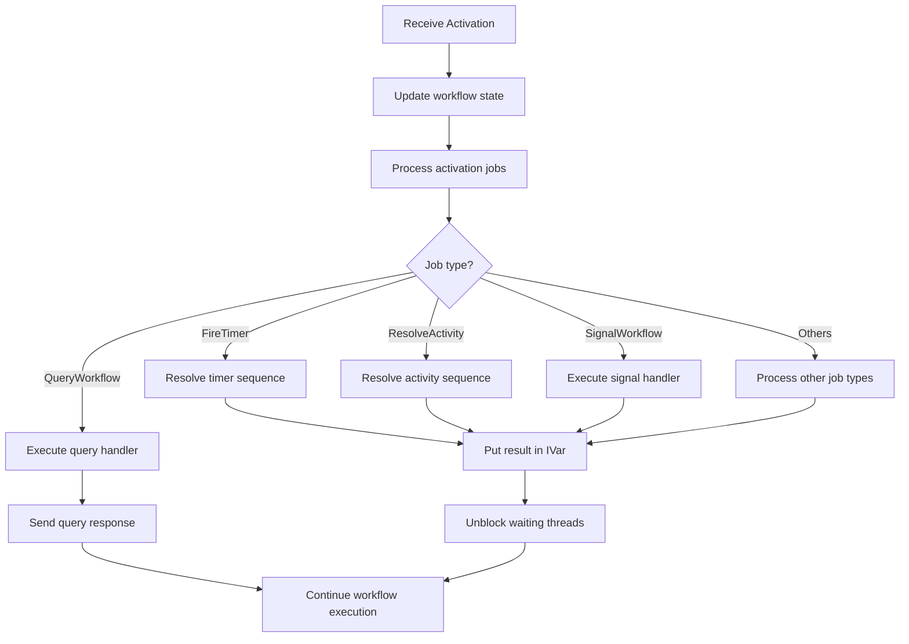
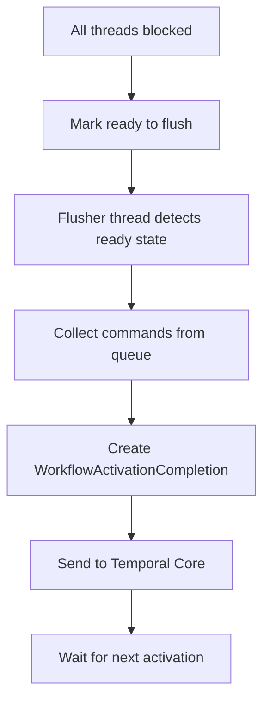
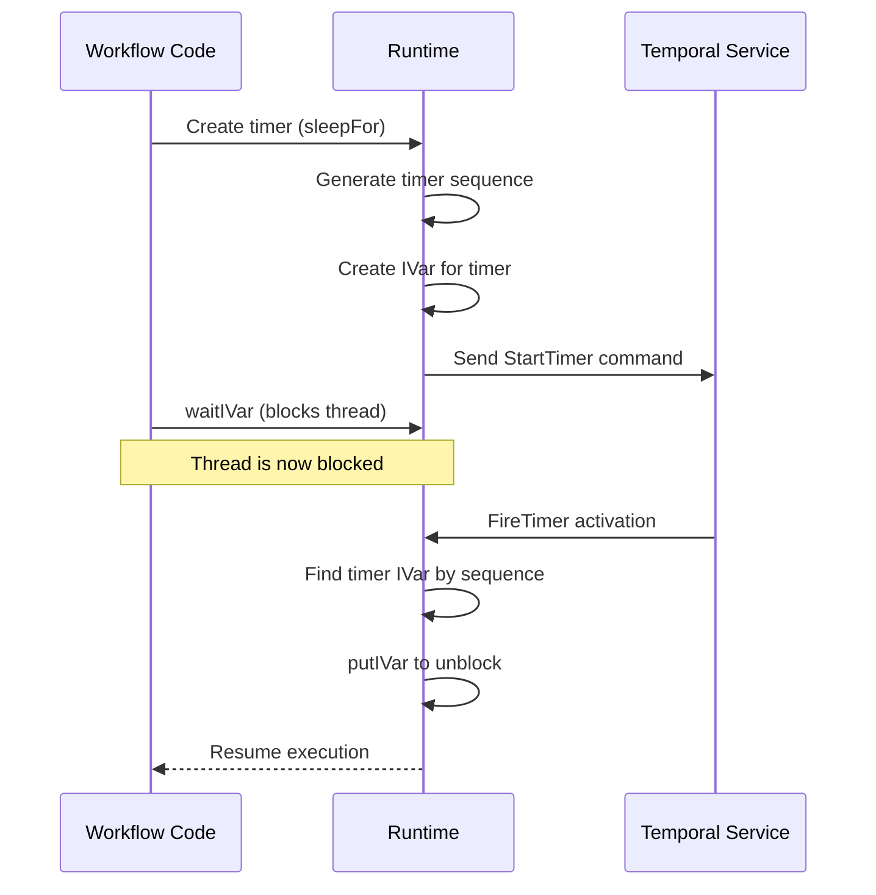
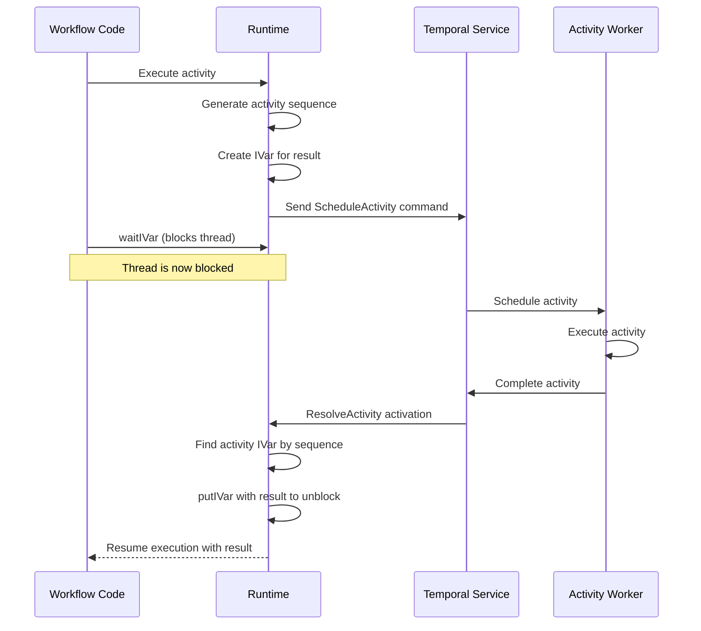

# Workflow STM Implementation

How we use STM to implement Temporal workflows in Haskell.

*See also: [Command Queue](command-queue.md) | [Sequence Management](sequence-management.md)*

## Core Concepts

We chose STM (Software Transactional Memory) as our concurrency mechanism for several reasons:

1. **Determinism** - STM transactions are atomic, which helps with deterministic replay
2. **Composition** - Complex concurrent operations can be composed while preserving atomicity
3. **Natural blocking** - STM gives us clean primitives for blocking operations

## Thread Management

Every workflow has multiple threads:

- **Main thread**: Runs the workflow implementation
- **Scheduler thread**: Waits for all threads to block, then triggers command flushing
- **Flusher thread**: Sends commands to Temporal
- **Worker threads**: Handle signals, timers, etc.

We track every thread's state through a `ThreadManager`:

```haskell
newtype ThreadManager = ThreadManager
  { threadManager :: TVar (HashMap.HashMap ThreadId WorkflowThread)
  }

data WorkflowThread = WorkflowThread
  { workflowThreadBlocked :: {-# UNPACK #-} !(TVar Bool)
  }
```

## Blocking Mechanism

A key part of our implementation is tracking when threads are blocked. When all threads are blocked, we flush commands to Temporal.

We use `IVar`s for this purpose:

```haskell
data IVar a = IVar
  { ivar :: {-# UNPACK #-} !(TMVar a)
  , blocks :: {-# UNPACK #-} !(TVar (HashMap.HashMap ThreadId WorkflowThread))
  , manager :: {-# UNPACK #-} !ThreadManager
  }
```

When a thread waits on an `IVar`:

```haskell
waitIVar IVar{..} = do
  tid <- myThreadId
  atomically do
    -- Find our thread state
    -- If value isn't available:
    --   Mark thread as blocked
    --   Register in blocks map
    -- Otherwise just return the value
```

When an `IVar` gets a value:

```haskell
putIVar IVar{ivar, blocks} x = void do
  _ <- tryPutTMVar ivar x
  currentlyBlocked <- readTVar blocks
  for_ currentlyBlocked (\blocked ->
    writeTVar blocked.workflowThreadBlocked False)
  writeTVar blocks mempty
```

## Execution Flow



## Blocking and Unblocking



## Activation Processing

When an activation comes in from Temporal Core, we need to unblock the right threads. The [Sequence Management](sequence-management.md) system helps match activations with their waiting threads.



The `activate` function processes incoming activations:

```haskell
activate :: WorkflowRuntime -> WorkflowActivation -> ThreadId -> STM (IO ())
activate runtime act tid = do
  -- Update workflow state
  -- Apply jobs atomically to ensure all threads can unblock together
  -- Handle any errors during job processing
```

Each job type has a specific handler that:
1. Finds the right sequence/handler
2. Puts the result in the corresponding IVar, unblocking waiting threads
3. Returns any non-STM operations that need to run

## Command Flushing

Once all threads are blocked, we flush commands to Temporal using the [Command Queue](command-queue.md):



## Concurrency Primitives

### IVar

Our main synchronization primitive is `IVar`, which represents a value that may not exist yet:

- `newIVar`: Creates a new empty `IVar`
- `putIVar`: Sets the value, unblocking any waiting threads
- `waitIVar`: Waits for the value, marking the thread as blocked
- `tryReadIVar`: Non-blocking read attempt

### Condition

For more complex synchronization:

```haskell
newtype Condition a = Condition (STM a)
```

- `waitCondition`: Blocks until a condition becomes true

## Ensuring Determinism

Our STM approach ensures determinism by:

1. Making state changes atomic and composable
2. Tracking thread blocking to know when the workflow is truly stuck
3. Handling activations deterministically
4. Ensuring signals and queries operate on consistent workflow state

## Implementation Challenges

### Thread Management

All threads must be tracked in the `ThreadManager`, including:
- Main workflow thread
- Signal handler threads
- Child workflow threads
- Local activity threads

### Deadlock Detection

We include optional deadlock detection:

```haskell
eResult <- case inst.workflowDeadlockTimeout of
  Nothing -> apply
  Just timeoutDuration -> do
    res <- UnliftIO.timeout timeoutDuration apply
    case res of
      Nothing -> pure $ Left $ toException $
                 LogicBug WorkflowActivationDeadlock
      Just res' -> pure res'
```

### Cancellation

Workflow cancellation propagates to all active threads:

```haskell
handleCancelWorkflow runtime _ = do
  putIVar runtime.workflowRuntimeCancelRequested ()
  pure $ pure ()
```

## Practical Examples

### Timer Implementation



### Activity Implementation



## Conclusion

The STM-based workflow implementation provides an elegant and powerful solution for managing the complex concurrency requirements of Temporal workflows in Haskell. By using STM's transactional properties and blocking mechanisms, the SDK ensures deterministic execution while allowing for complex workflow patterns to be expressed naturally.

> **Navigation:**
> - [Back to Documentation Index](README.md)
> - [Command Queue Documentation](command-queue.md)
> - [Sequence Management Documentation](sequence-management.md)
